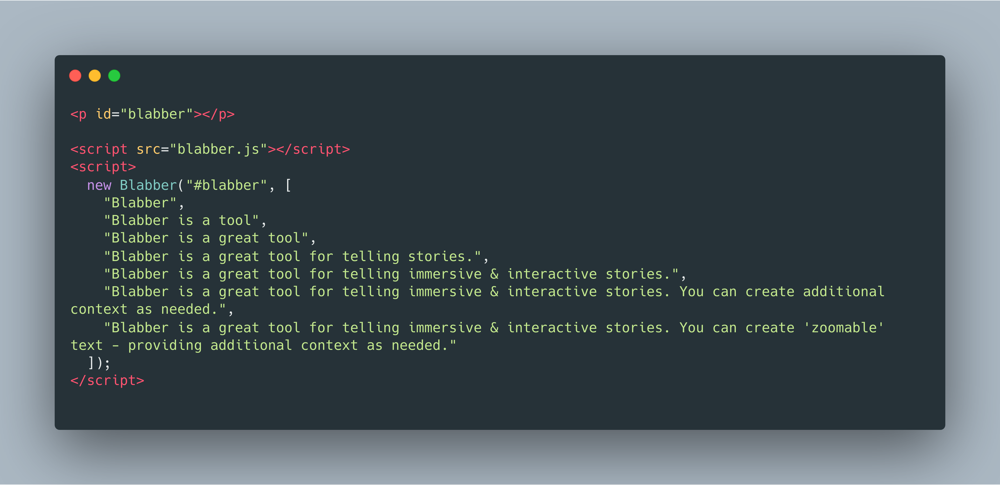

# blabber

**Video Example**


**Code Example**



### Installing

```
git clone https://github.com/luiscarbonell/blabber
```


### Usage

```javascript
new Blabber([DOMSelecor][, Blabbers][, Options]);
```

### Interface Options

**Option 2**
```html
<p id="money"></p>
```

```javascript
new Blabber("money", ["money", "more money", "we make you more money"])
```

**Option 1**

```html
...
<p><span id="money"></span></p>
...
```

```javascript
new Blabber({
  el: "#money",
  from: "More money",
  to: "We've helped over 9,000 companies achieve over 3x in annualized revenue"
});
```

### Acknowledgements

* [Online Video Cutter](https://online-video-cutter.com/)
* [Screen Recorder](https://chrome.google.com/webstore/detail/screen-recorder/hniebljpgcogalllopnjokppmgbhaden)
* [Source Code Images](https://carbon.now.sh)
